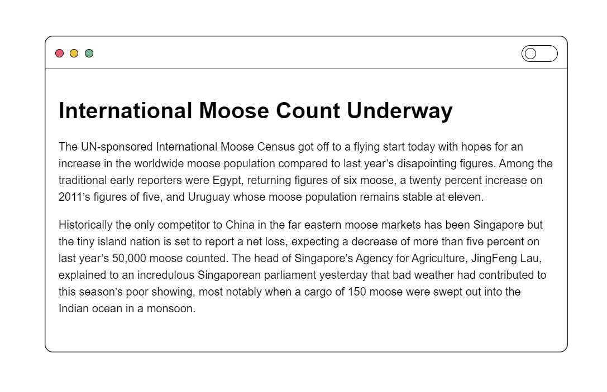
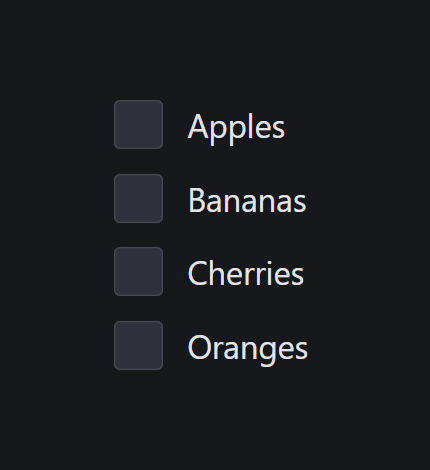
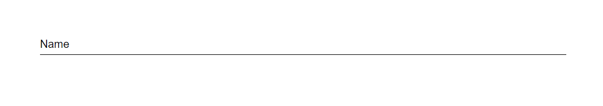
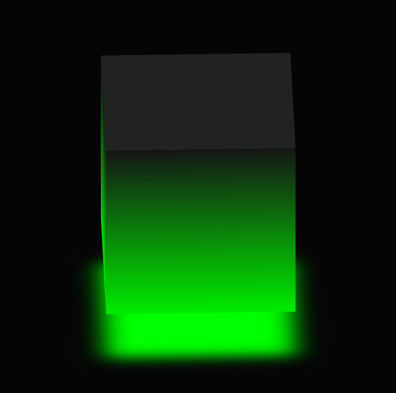
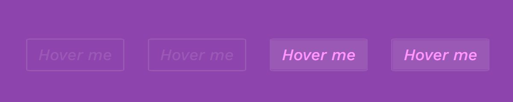
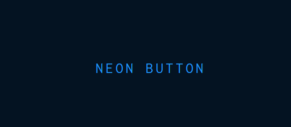
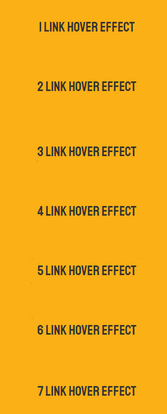
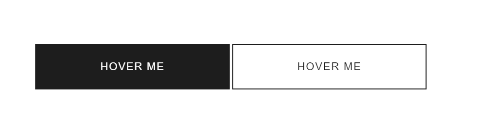
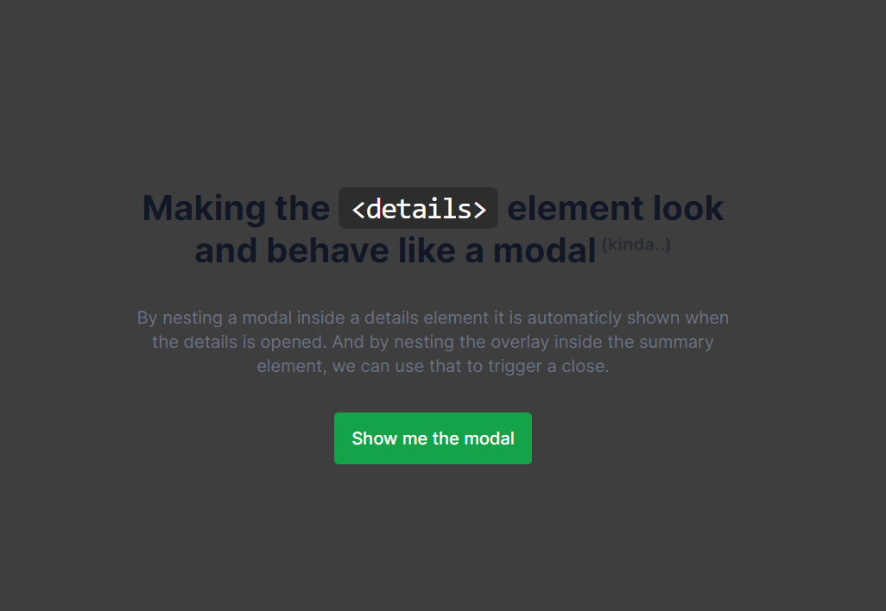

<!-- PROJECT LOGO -->
 

<h2 align="center">Animations</h2>

  

    <a href="https://github.com/Freekson/various-animations/issues">Report Bug</a>

  

<!-- TABLE OF CONTENTS -->

  
Table of Contents

  <ol>   
    <li><a href="#Article-toogle">Article toogle</a></li>
    <li><a href="#Form-checkbox">Form checkbox</a></li>
    <li><a href="#Animated-input">Animated input</a></li>
    <li><a href="#Animated-cube">Animated cube</a></li>
    <li><a href="#Animated-text">Animated text</a></li>
    <li>
        <a href="#Button-and-links">Button and links</a>
        <ul>
            <li><a href="#Hover-effects">Hover effects for buttons</a></li>
            <li><a href="#Neon-btn">Neon Light Button</a></li>
            <li><a href="#Effect-links">Effects for links</a></li>
             <li><a href="#Arrow-hover">Button with arrow on hover</a></li>
        </ul>
    </li>
    <li>
        <a href="#Menu">Menu</a>
        <ul>
            <li><a href="#Animations-menu">Animations for menu</a></li>
            <li><a href="#Icon-animation">Icon animation</a></li>
        </ul>
    </li>
    <li><a href="#Modal-window">Modal window</a></li>
    <li><a href="#Card-slider">Card slider</a></li>
    <li><a href="#contact">Contact</a></li>
  </ol>

# Article toogle

# Form checkbox

# Animated input
 

# Animated cube

# Animated text

# Hover effects for buttons

# Neon Light Button

# Effects for links

# Button with arrow on hover

# Animations for menu

# Icon animation

# Modal window

# Apline slider

# Contact

Yehor Dreval 

- [instagram](https://www.instagram.com/freeksons)
- [telegram](https://t.me/freekson)

Project Link: [Animations](https://github.com/Freekson/various-animations)

(<a href="#top">back to top</a>)

